# Web Development From Scratch

---

# What is this course about?

- Learn basic HTML5, CSS and Javascript from scratch
- No pre-requisite necessary
- Won't teach you everything there is about Web Dev, but enough so you can explore on your own after the course

---

# 1. HTML5

# What is HTML5?

- HTML5 is the latest version of **H**yper**T**ext **M**arkup **L**anguage, or HTML
- It is *the* language of the Web
- It describes _the structure and content_ of web pages
- It is used together with CSS (**C**ascading **S**tyle**S**heet) and Javascript to make web pages rich and interactive

### By the end of this chapter
- Make a self profile page

---

# Starting very simply

    !html
    <!DOCTYPE html>
    <html>
      <head>
        <title>Carl Fredricksen's Profile</title>
      </head>
      <body>
        Welcome to Carl Fredricksen's Profile page!
      </body>
    </html>

- HTML5 is made up of tags that usually come in nested pairs
- ... like `<X> <Y> ... </Y> </X>`
- The top-most tag is `<html>`, which has two child tags: `<head>` and `<body>`
- `<title>` is a child tag of `<head>`
- Content of the web page goes inside the `<body>` tag
---

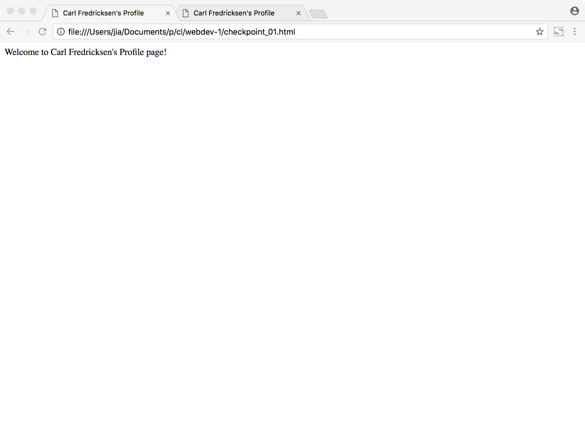

.fx: imageslide

---

# Images and links

    !html
    <body>
      Welcome to Carl Fredricksen's Profile page!
      
      Click <a href='http://pixar.wikia.com/wiki/Carl_Fredricksen'>here</a> 
      to go to my wiki page.
    </body>

- Tags have attributes (or properties), specified like `name='value'`
- Did you notice?
    - `` has no closing tag
    - Browser ignores line breaks. How do we change that?

---

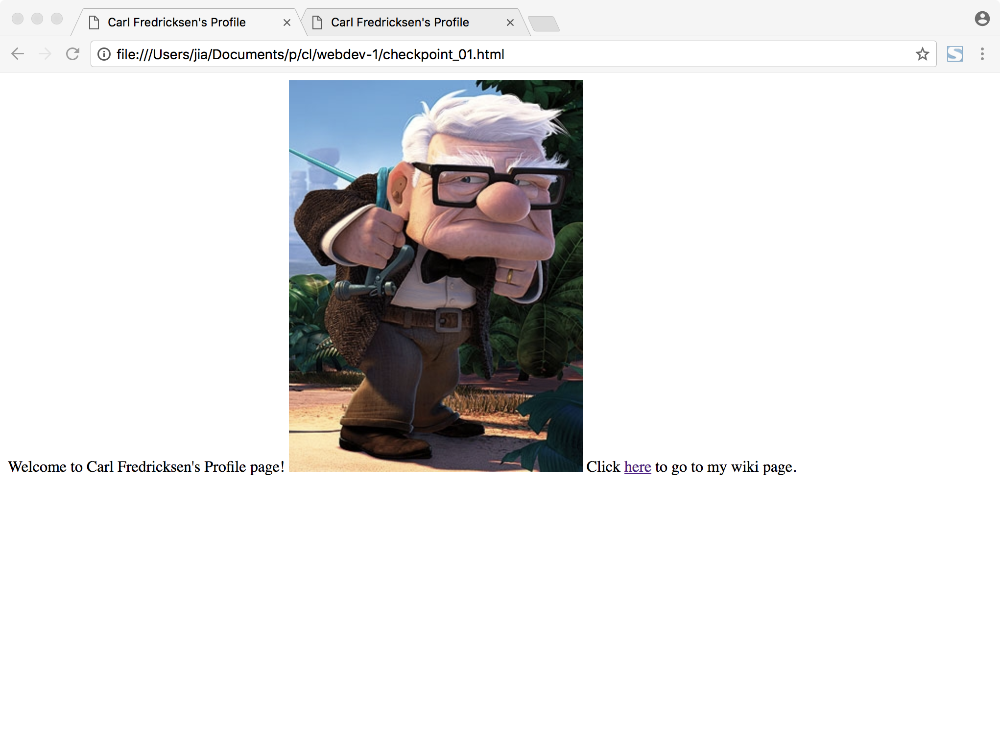

.fx: imageslide

---

# Headings, paragraphs and text format

    !html
    <body>
      <h1>Welcome to Carl Fredricksen's Profile page!</h1> 
      

      <h3>Links</h3>
      
Click <a href='http://pixar.wikia.com/wiki/Carl_Fredricksen'>here</a> 
         to go to my wiki page.
      

      <h3>Hobbies</h3>
      
I <strong>love</strong> travelling, 
         <em>especially</em> by balloons.
      

    </body>

- 5 levels of headings: from `<h1>` to `<h5>`
- `
` organizes text into paragraphs
- `<em>` (emphasis) is for _italics_, `<strong>` is for **bold**

---

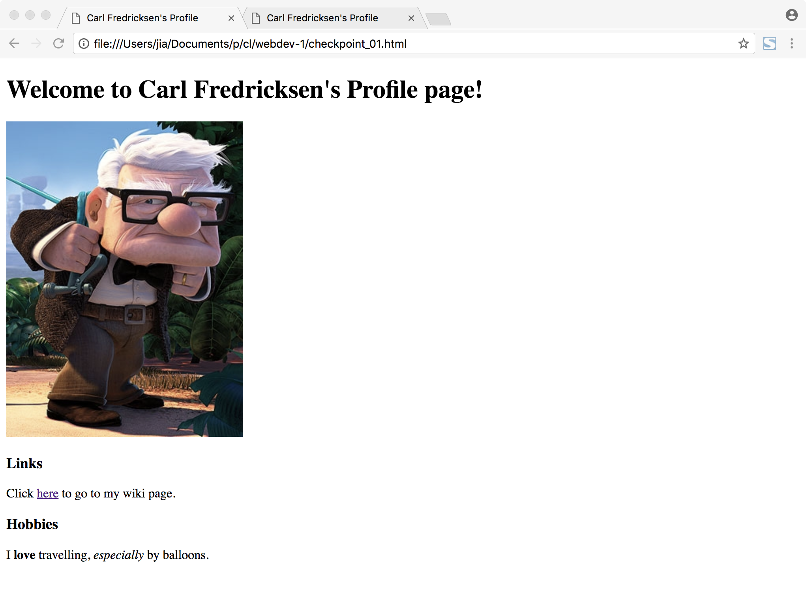

.fx: imageslide

---

# Tables

    !html
    <table>
        <tr> <td>Name</td> <td>Carl Fredricksen</td> </tr>
        <tr> <td>Age</td> <td>78</td> </tr>
        <tr> <td>Occupation</td> <td>Retiree</td> </tr>            
        <tr> <td>Email</td> 
             <td><a href='mailto:carl@paradisefalls.org'>
                    carl@paradisefalls.org
                 </a>
             </td>
        </tr>
    </table>

---

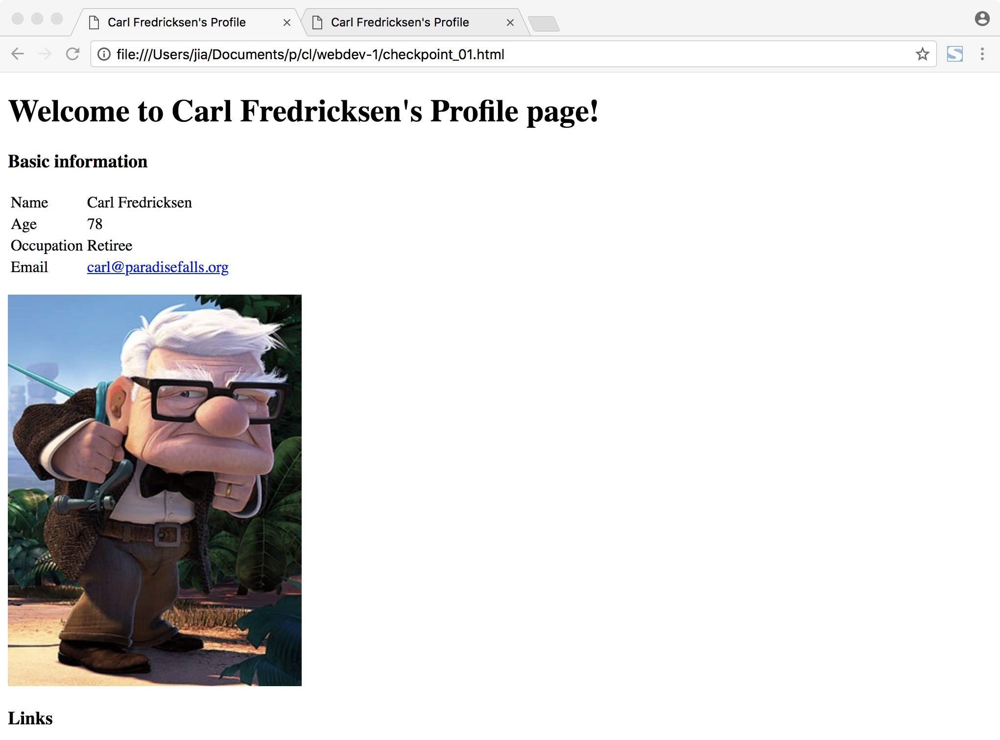

.fx: imageslide

---

# Lists, ordered and unordered

    !html
    <h3>Friends</h3>
    <ul>
      <li>Russell</li>
      <li>Dug</li>
      <li>Kevin</li>
    </ul>
    <h3>Countries travelled</h3>
    <ol>
      <li>Venezuela</li>
    </ol>

- `<ul>` is **u**nordered **l**ist - bullets are not numbered
- `<ol>` is **o**rdered **l**ist - bullets are numbered
- `<li>` is **l**ist **i**tem, can be used in either `<ol>` or `<ul>`
- A list can be nested inside another one

---

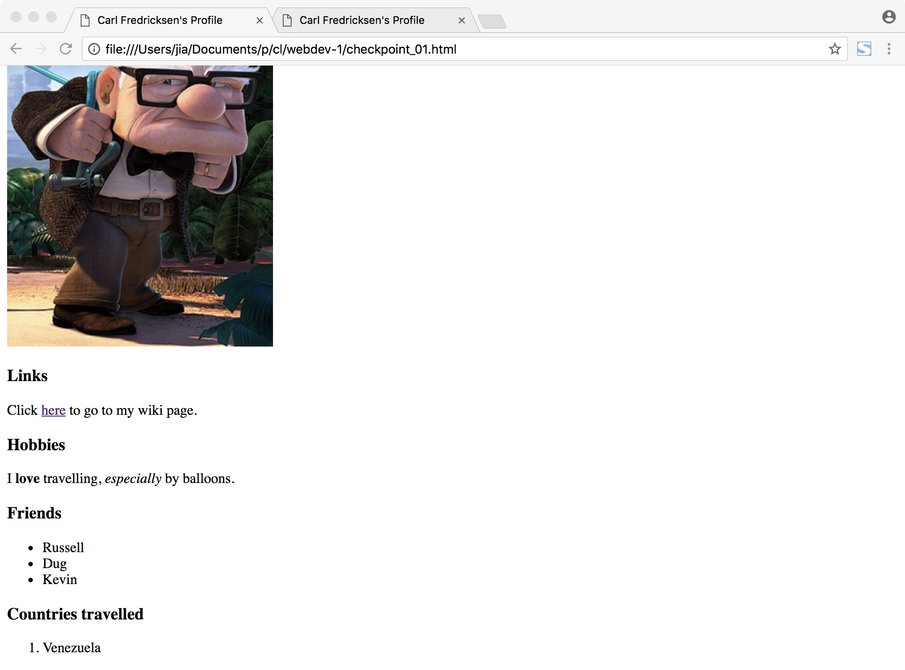

.fx: imageslide

-------------------------------------------------------------------------------

# 2. CSS

---

# What is CSS?

- **C**ascading **S**tyle**S**heet
- It describes _the format, style and layout_ of web pages

### By the end of this chapter
- Format the self profile page like this

---

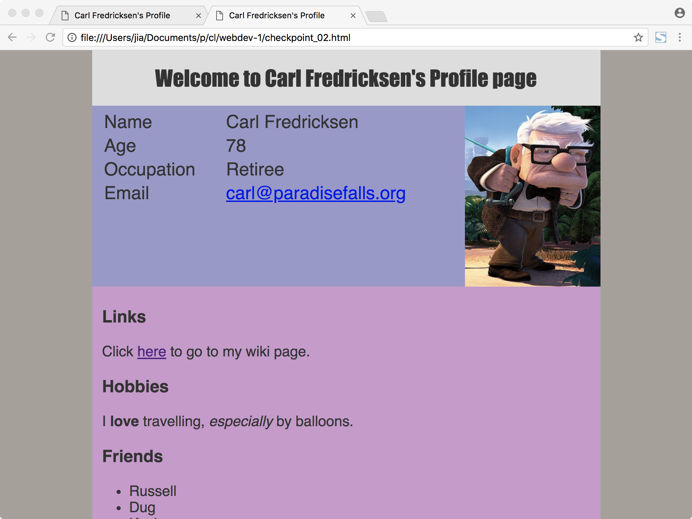

.fx: imageslide

---

# Directory structure

Use the following structure to keep things neat and allow for future expansion

    my_profile_dir
     |
     |-- css
     |    |
     |    |-- main.css
     |
     |-- img
     |    |
     |    |-- mugshot.jpg
     |
     |-- index.html

---

# Embedding CSS in web page

    !html
    <head>
      <title>Carl Fredricksen's Profile</title>
      <link rel='stylesheet' type='text/css' href='css/main.css'>
    </head>

---

# Introducing the `
` HTML element

    !html
    <body>
      

        

        

        

        

        

        

        

        

        

        

      

    </body>

- Used like containers to group content to sections 
- Works together with CSS to format web pages
- Give them unique names using the `id` attribute

---

# Moving content inside `
`s

    !html
    

      

        <h1>Welcome to Carl Fredricksen's Profile page</h1>
      

      

        <table>
            <tr><td>Name</td> <td>Carl Fredricksen</td></tr>
            <tr><td>Age </td> <td>78</td></tr>
            <tr><td>Occupation</td> <td>Retiree</td></tr>            
            <tr><td>Email</td> 
                <td><a href='mailto:carl@paradisefalls.org'>
                carl@paradisefalls.org</a></td>
            </tr>
        </table>
      

      ...
    

---

# Changing colors

    !css
    body 
    {
        color: #333333;
        background-color: #a7a09a;
    }

- `body` is called the _selector_
- `{...}` contains properties and values being set
- `#333333` and `#a7a09a` are RGB color codes

---

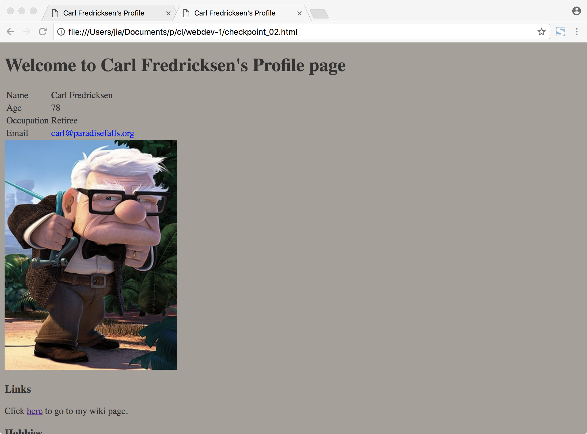

.fx: imageslide

---

# The RGB color code

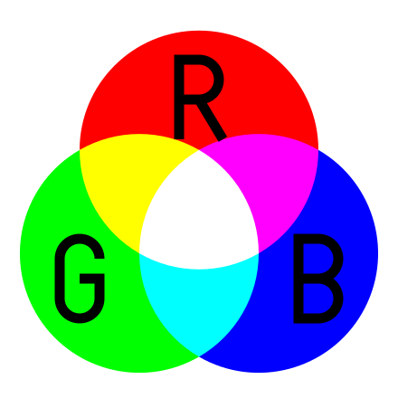

- Uses a mixture of Red, Green and Blue components to represent colors
- A number from 0 to 255 represents the 'intensity' of the component, written in base-16, i.e. from `00` to `ff`. _Quiz: how many colors can RGB represent?_
- For example: #ff0000 is red, #ffff00 is yellow
- The RBG calculator: [https://www.w3schools.com/colors/colors_rgb.asp](https://www.w3schools.com/colors/colors_rgb.asp)

---

# The _selector_ - 1

- "Selects" the HTML element(s) whose properties are to be modified
- 3 basic kinds:
    - by element type, e.g. `body { ... }`
    - by element id, e.g. `#header { ... }`
    - by element class, e.g. `.someclass { ... }` (will see it in chapter 3)
- Mix-and-match
    - example 1: `div#header { ... }`
    - example 2: `div h1 { ... }`
    - example 3: `#header h1, #header h2 { ... }`

_Can you guess what each of selectors in the above examples do?_

---

# The _selector_ - 2

- example 1: `div#header { ... }`
    - The `
` element is selected
- example 2: `div h1 { ... }`
    - All `<h1>` elements that are _inside_ any `
` element are selected
- example 3: `#header h1, #footer h2 { ... }`
    - All `<h1>` elements that are _inside_ any HTML elements with `id='header'`, plus all `<h2>` elements that are _inside_ any HTML elements with `id='footer'` are selected
- Selector syntax is complex
    - For complete reference, visit [https://www.w3schools.com/cssref/css_selectors.asp](https://www.w3schools.com/cssref/css_selectors.asp)

---

# What are the properties I can change?

- This site [https://www.w3schools.com/cssref/default.asp](https://www.w3schools.com/cssref/default.asp) is a good reference

---

# Before we go further ...

Let's give each `
` a different background color. This will help our eyes when we re-arrange them.

---

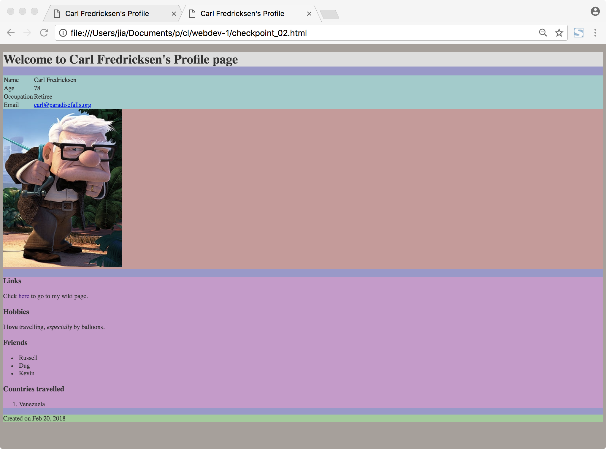

.fx: imageslide

---

# Changing fonts

    !css
    #header h1
    {
        font-family: 'Impact';
    }
    #overview
    {
        ...
        font-family: 'Helvetica';
        font-size: 20pt;
    }
    #detail
    {
        ...
        font-family: 'Helvetica';
        font-size: 16pt;
    }
    #footer
    {  
        font-family: 'Courier New';
        font-size: 12pt;
    }

---

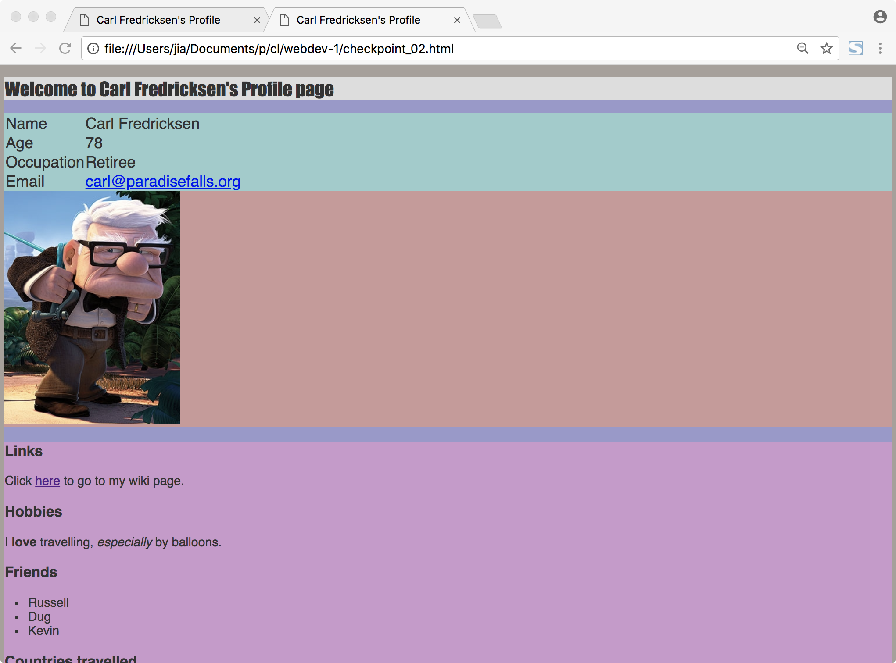

.fx: imageslide

---

# The Box Model

---

# Centering the page

    !css
    #container
    {
        max-width: 750px;
        margin-top:    0;
        margin-bottom: 0; 
        margin-left:   auto;
        margin-right:  auto;
        background-color: #99c;
    }
- `max-width` 
    - when browser is larger, element's width is set to 750px; when browser is smaller, the element will be automatically resized
- `auto` for margin
    - Browser will automatically determine the margin size using any space left.
    - This has a centering effect when used for left and right margins.

---

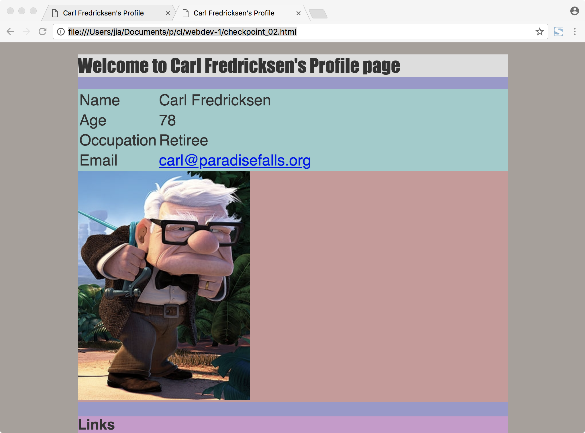

.fx: imageslide

---

# Putting `
`s side-by-side

    !css
    #overview
    {
        float: left;
        width: 550px;
    }
    #mugshot
    {
        float: right;
        width: 200px;
    }
    #mugshot img
    {
        display: block; /* what does this line do??? ;-) */
        max-width: 100%;
        max-height: 100%;
    }

- `float` allows elements to be side by side, instead of one after another
- Remove `display: block` and see what happens. [Explanation](https://stackoverflow.com/questions/31444891/mystery-white-space-underneath-image-tag/31445364#31445364)

---

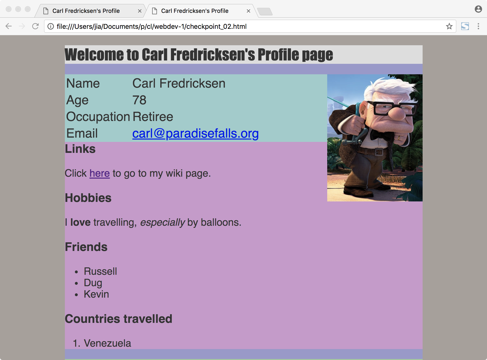

.fx: imageslide

---

# Staying clear of floated elements

    !css
    #detail
    {
        ...
        clear: both;
    }

- Did you notice the 'detail' section went under the mugshot?
    - This happens to elements next to floated ones
    - Solution: `clear: both;`

---

.fx: imageslide

---

# Using Chrome to troubleshoot

- What is this gap? Let's use Chrome's Developer Tool to find out

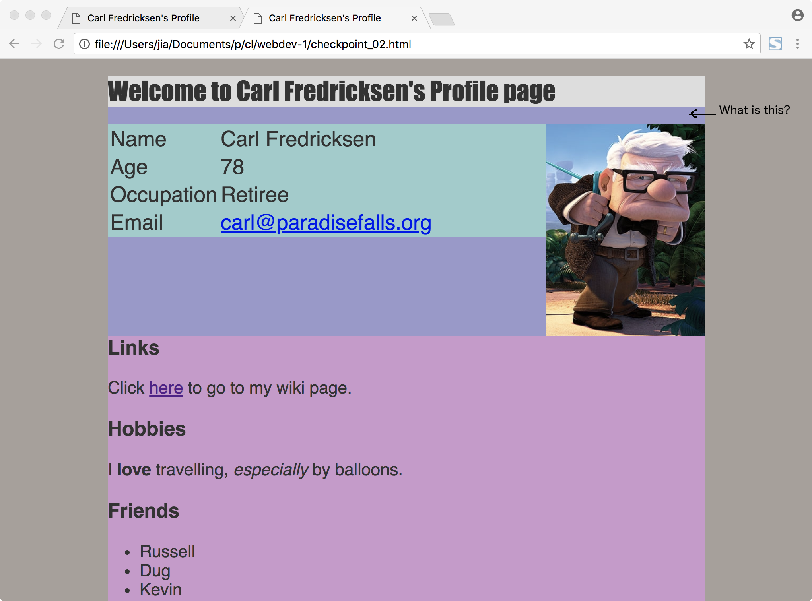

---

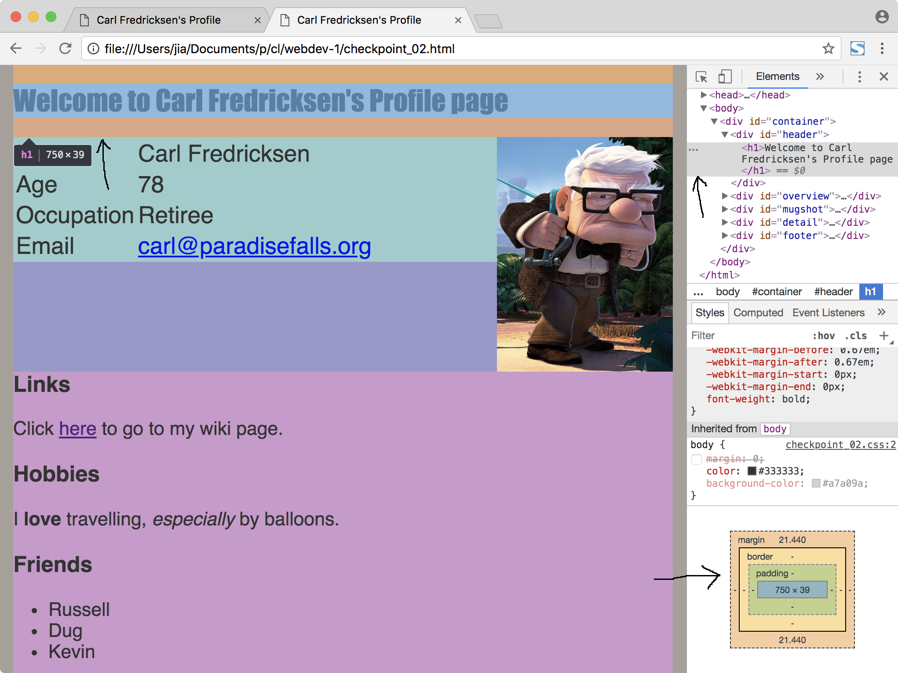

.fx: imageslide

---

# Margin collapsing

- "The top and bottom margins of blocks are sometimes combined (collapsed) into a single margin whose size is the largest of the individual margins (or just one of them, if they are equal), a behavior known as margin collapsing." - [MDN](https://developer.mozilla.org/en-US/docs/Web/CSS/CSS_Box_Model/Mastering_margin_collapsing)
- Occurs when parent has no margin or padding to separate itself from its first or last child
- The collapsed margin ends up outside the parent

---

# Margin collapsing - the fix

    !css
    div
    {
        padding-top: 0.1px;
        padding-bottom: 0.1px;
    }
    
---

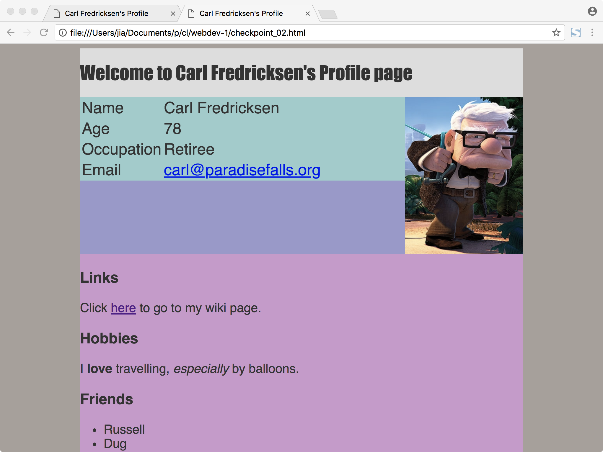

.fx: imageslide

---

# Final touches - 1

Add paddings to make things look less crammed

    !css
    #overview
    {
        padding-top:    5px;
        padding-bottom: 5px;
        padding-left:  15px;
        padding-right: 15px;
    }
    #detail
    {
        padding: 5px 15px;       
    }
    #footer
    {
        padding: 5px 15px;        
    }
---

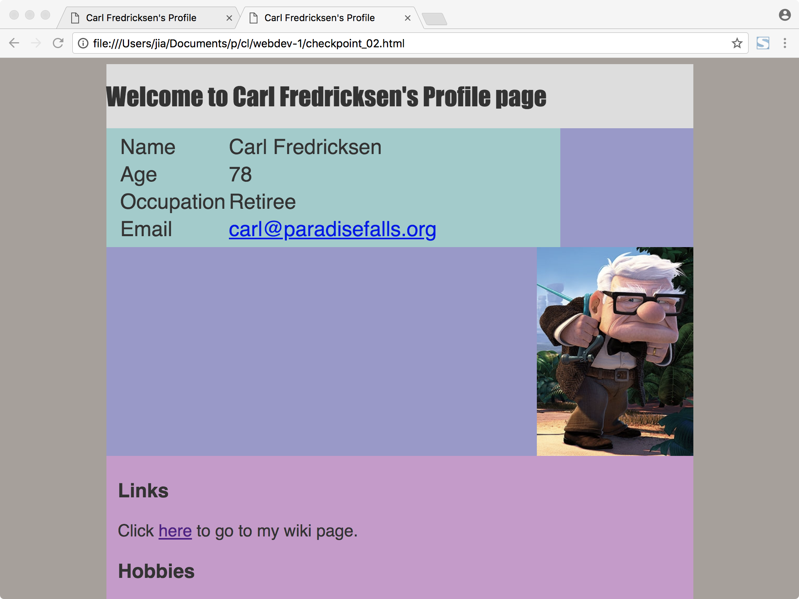

.fx: imageslide

---

# Finak touches - 1 _what's wrong?_

Need to subtract left and right padding from width

    !css
    #overview
    {
        width: 520px;         /* was 550px */
        padding-top:    5px;
        padding-bottom: 5px;
        padding-left:  15px;
        padding-right: 15px;        
    }

---

.fx: imageslide

---

# Final touches - 2

    !css
    body
    {
        margin: 0;
    }
    #header h1
    {
        text-align: center; 
    }
    td#fieldname
    {
        width: 40%;
    }
    #overview
    {
        background-color: #9cc;
    }

---

.fx: imageslide

-------------------------------------------------------------------------------

# 3. Javascript

---

# What is Javascript, and why?

- The scripting language for the web, often used in browsers (called front-end scripting).

- We can use Javascript to do many things
    - add/change/remove content
    - validate user input
    - show/hide content with CSS
    - create a game using HTML5 Canvas

---

# Directory structure

Use the following structure to keep things neat and allow for future expansion

    my_site_dir
     |
     |-- css
     |    |
     |    |-- main.css
     |
     |-- js
     |    |
     |    |-- main.js
     |
     |-- img
     |    |
     |    |-- mugshot.jpg
     |
     |-- index.html

# Embedding Javascript

Use the `
    </html>

---

# Puppy face `/(^.^)\`

`index.html`

    !html
    <!DOCTYPE html>
    <html>
      <head>
        <title>My Javascript sandbox</title>
      </head>
      <body>
        

      </body>
      
    </html>

`css/main.js`

    !javascript
    var myDiv = document.getElementById('myDiv');
    var myP = document.createElement('p');
    myP.innerText = '/(^.^)\\';
    myDiv.appendChild(myP);

---

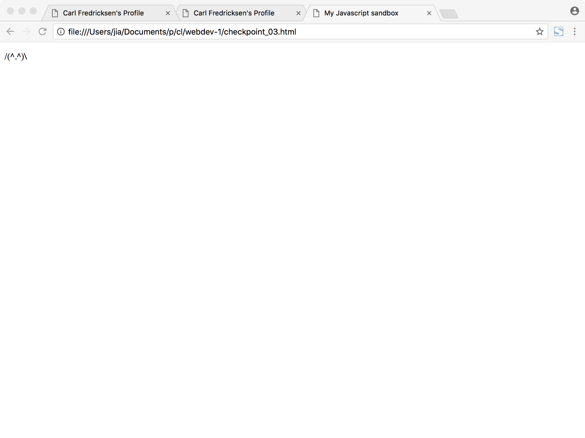

.fx: imageslide

---

# Puppy face `/(^.^)\` _what's going on?_

1. In HTML, create an empty `
` and give it an unique ID `'myDiv'`
2. In Javascript, retrieve (aka getting a handle of) this `
` using `document.getElementByID()`
3. Create a new `
` element using `document.createElement()`
4. Set this `
`'s `innerText` property to puppy face
5. Add this `
` to `myDiv` as a child using `myDiv.appendChild()`

### Javascript syntax
- Use `var` to declare a variable
- Use `=` to assign value to an variable or its property
- Use single quote `'` (or double quote `"`) to enclose a string of characters

---

# Lots of puppies

    !javascript
    var myDiv = document.getElementById('myDiv');
    for (var i = 0; i < 10; i++)
    {
      var myP = document.createElement('p');
      myP.innerText = i + ': ' + '/(^.^)\\';
      myDiv.appendChild(myP);
    }

### Javascript syntax
- The for-loop:

`for ( [Initial Expression]; [Condition]; [Step Expression]) { ACTION }`

- `i++` is a shorthand for `i = i + 1`
- `+` does addition when both operands are numbers; when any of them is a string, it does string _concatenation_

---

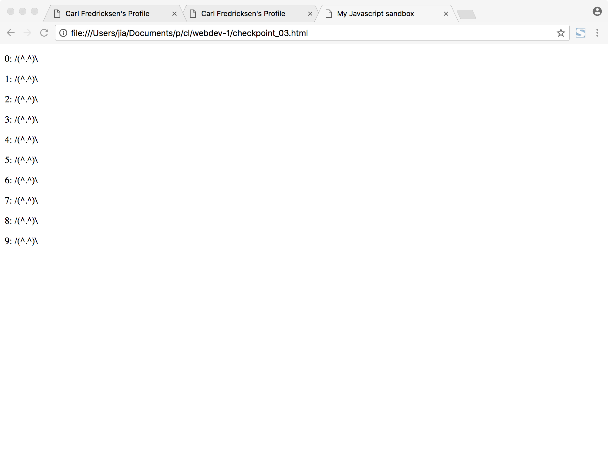

.fx: imageslide

---

# Kitty in puppies

    !javascript
    var myDiv = document.getElementById('myDiv');
    for (var i = 0; i < 10; i++)
    {
      var myP = document.createElement('p');
      if (i === 5)
      {
        myP.innerText = i + ': ' + '=(^.^)=';
      }
      else
      {
        myP.innerText = i + ': ' + '/(^.^)\\';
      }
      myDiv.appendChild(myP);
    }

### Javascript syntax
- The if-else-branches: `if ( [Condition] ) { Action A } else { Action B }`
- `i++` is a shorthand for `i = i + 1`

---

.fx: imageslide

---

# Introducing booleans

- A boolean is either `true` or `false`
    - Real world example: light switch (on or off), yes/no question (yes or no)
- [Condition] used in for-loop or if-else-branches must evaluate to a boolean
- How to write a boolean expression?
    - use comparison operators 
    <table>
    <tr><th>Operator</th><th>Meaning</th></tr>
    <tr><td>a === b</td><td>Is a equal b?</td></tr>
    <tr><td>a !=  b</td><td>Is a NOT equal b?</td></tr>
    <tr><td>a  >  b</td><td>Is a greater than b?</td></tr>
    <tr><td>a >=  b</td><td>Is a greater than or equal to b?</td></tr>
    <tr><td>a  <  b</td><td>Is a less than b?</td></tr>
    <tr><td>a <=  b</td><td>Is a less than or equal to b?</td></tr>
    </table>
    - `true` and `false` themselves are booleans

---

# Boolean operators

- Boolean operators work on booleans just like `+` or `-` work on numbers
  <table>
    <tr><th>Name</th><th>Operator</th><th>Meaning</th></tr>
    <tr><td>AND</td><td>a && b  </td><td>`true` if **both** a **and** b are true, `false` otherwise</td></tr>
    <tr><td>OR</td><td>a || b  </td><td>`true` if **either** a **or** b is true, `false` otherwise </td></tr>
    <tr><td>NOT</td><td>! a</td><td>`true` if a is `false`, `false` if a is `true`</td></tr>
  </table>
- Quiz: Evaluate the following boolean expressions, given `a=5` and `b=7`
    - `a > 6 && b > 6`
    - `a != 7 || b === 7`
    - `(a + b) <= 12`
    - `!((a - b) > 0)` 
    - `a < 8 && b < 8 && (a + b) <= 12`

---

# Creating functions

Why? To reuse code, and to reduce code complexity. 

A function has 3 parts: a name, a list of parameters and a body.

    !javascript
    function drawPuppiesAndKitty(where, howMany)
    {
      var myDiv = document.getElementById(where);

      for (var i = 0; i < howMany; i++)
      {
        var myP = document.createElement('p');
        if (i === 5)
        {
          myP.innerText = i + ': ' + '=(^.^)=';
        }
        else
        {
          myP.innerText = i + ': ' + '/(^.^)\\';
        }
        myDiv.appendChild(myP);
      }
    }

---

# It's a Pawdemonium!

HTML

    !html
    ...
      <body>
        

Here are some furry friends

        

Another bunch of furry friends

      </body>
    ...

Javascript

    !javascript
    function drawPuppiesAndKitty(where, howMany)
    {
      ...
    }

    drawPuppiesAndKitty('myDiv', 7);
    drawPuppiesAndKitty('myDiv2', 6);

---

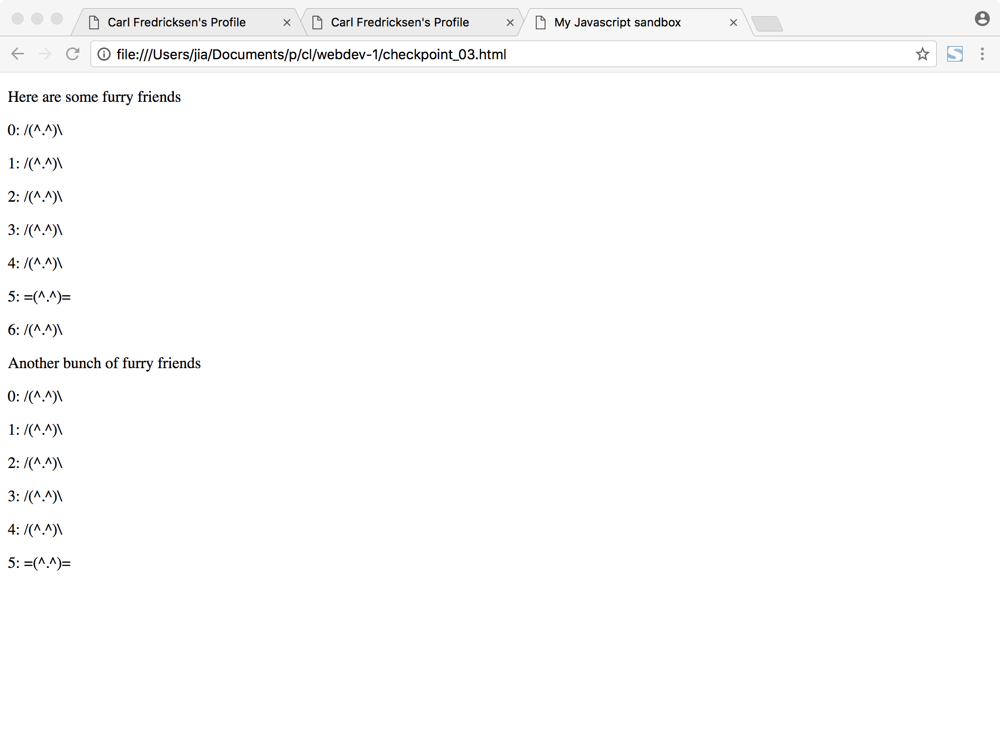

.fx: imageslide

---

# Introducing arrays

Think of an array as a row of chairs with numbers (starting from 0) on them

Let's create an array of pets:

    !javascript
    var pets = ['P', 'K', 'P', 'P', 'K', 'K']; // P for Puppy, K for Kitty

You can _access_ each pet by specifying its _index_, like ` var secondPet = pets[1];`

Can you write a function to draw an array of pets? _Hint: use a for-loop_

---

# Puppy or kitty, it's your call - 1

Create a new `
` for this exercise

    !html
    

An array of pets

We will declare and call our new function this way

    !javascript
    function drawPets(where, arrayOffPets)
    {
      ...
    }

    drawPets('myDiv3', pets);

---

# Puppy or kitty, it's your call - 2

    !javascript
    function drawPets(where, arrayOfPets)
    {
      var myDiv = document.getElementById(where);
      for (var i = 0; i < arrayOfPets.length; i ++)
      {
        var pet = arrayOfPets[i];
        var myP = document.createElement('p');
        switch (pet)
        {
          case 'P':
            myP.innerText = i + ': ' + '/(^.^)\\';
            break;
          case 'K':
            myP.innerText = i + ': ' + '=(^.^)=';
            break;
          default:
            myP.innerText = i + ': ' + '???';
            break;
        }
        myDiv.appendChild(myP);
      }
    }

---

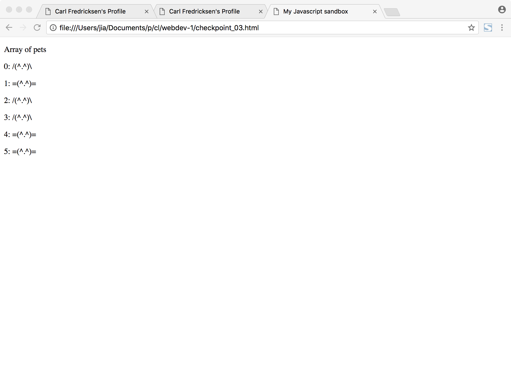

.fx: imageslide

---

# A puppy, kitty, or something else???

`switch` is handy when there are more than 2 branches

    !javascript
    switch (VARIABLE)
    {
      case VALUE_1:
        ACTION_1;
        break;
      case VALUE_2:
        ACTION_2;
        break;
      ...
      default:
        ACTION_DEFAULT;
        break;
    }

Try drawing this array of pets: `['P', 'K', 'P', 'P', 'K', 'F']`

---

# Hide-and-Seek!

Allow user to play hide-and-seek with a chosen pet. You need the following:

- a text box for user to enter the pet's number
- a 'Hide-and-Seek` button

HTML

    !html
    ...
    

      <label>Which pet? 
        <input id='petNumber' type='text' placeholder='Enter pet number'>
      </label>
      <button onclick='hideAndSeek("myDiv3")'>Hide-and-Seek</button>
    

    ...

---

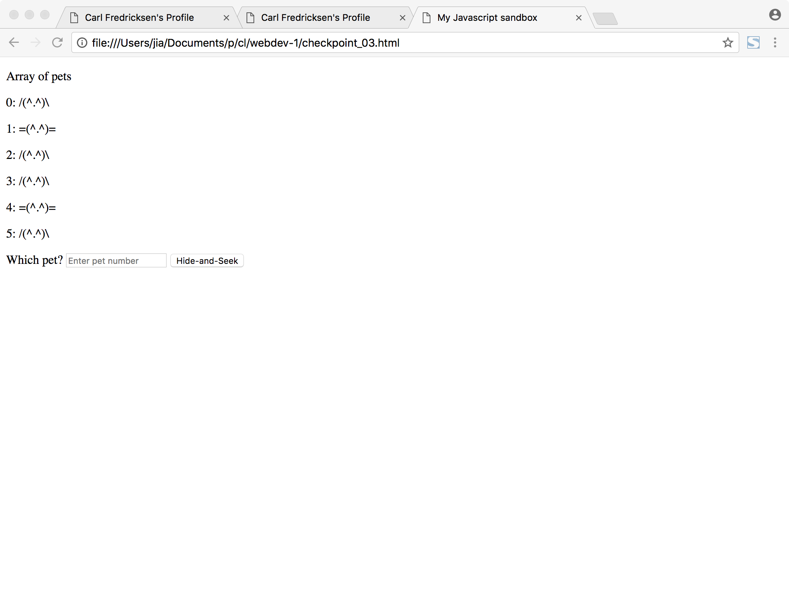

.fx: imageslide

---

# Introducing events and event handlers

- Analogy: You are home watching TV. The door bell rings, and you run downstairs to answer the door.
    - Event: door bell rings
    - Event handler: you answer the door
- For the complete list of events that you can respond to, see [this page](https://www.w3schools.com/jsref/dom_obj_event.asp)
- Event handlers are written in Javascript

---

# Naming the pets

    !javascript
    ...
      for (var i = 0; i < arrayOfPets.length; i ++)
      {
        var pet = arrayOfPets[i];
        var myP = document.createElement('p');
        myP.id = where + '_' + i;
        switch (pet)
        {
          case 'P':
    ...

Now, take a look in Chrome Developer Tools to inspect the generated content

---

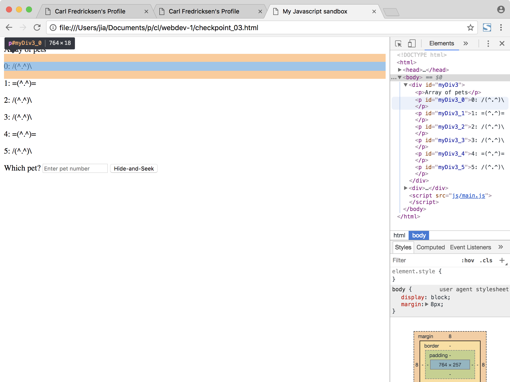

.fx: imageslide

---

# The CSS Invisibility Cloak

We will create a _class_ in CSS called `hidden`. Any HTML element belong to this class will become invisible. 

In CSS, the selector for a _class_ is denoted by a `.` in front of its name.

CSS

    !css
    .hidden
    {
      visibility: hidden;
    }

HTML

    !html
    <head>
      <title>My Javascript sandbox</title>
      <link rel="stylesheet" type="text/css" href="css/checkpoint_03.css">  
    </head>

---

# Now you see me, now you don't

    !javascript
    function hideAndSeek(where)
    {
      var petNumberInput = document.getElementById('petNumber');
      var petID = where + "_" + petNumberInput.value;
      var petP = document.getElementById(petID);

      if (petP.className != 'hidden')
      {
        petP.className = 'hidden';
      }
      else
      {
        petP.className = '';
      }
    }

---

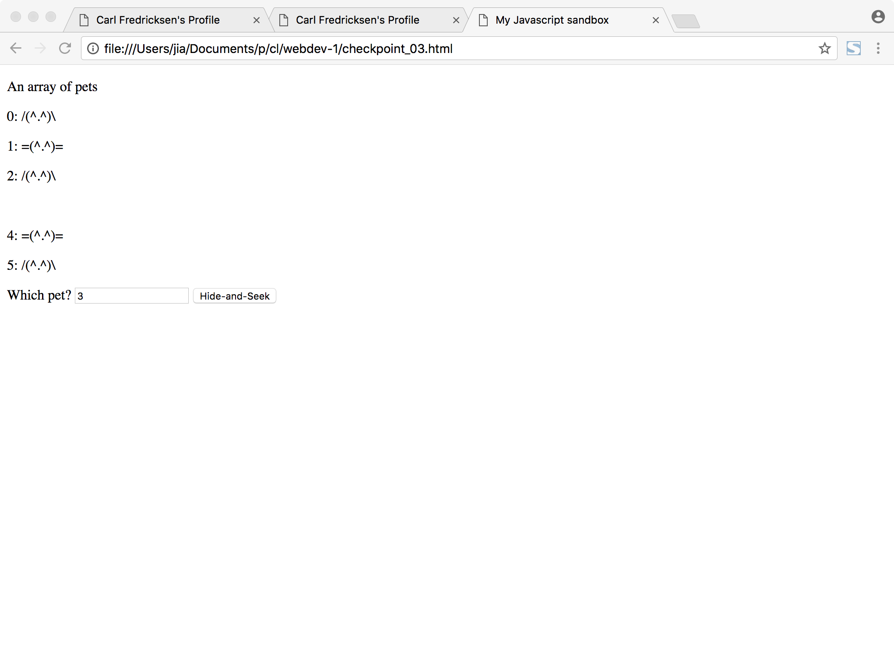

.fx: imageslide

---

# Validating input - 1

Check if user has entered a number

    !javascript
    function hideAndSeek(where)
    {
      var petNumberInput = document.getElementById('petNumber');
      if (isNaN(petNumberInput.value))
      {
        alert('Please enter a number!')
        return;
      }
      ...
    }

---

.fx: imageslide

---

# Validating input - 2

Try pressing the button without entering anything. Can you fix it?

    !javascript
    function hideAndSeek(where)
    {
      var petNumberInput = document.getElementById('petNumber');
      if (isNaN(petNumberInput.value) || petNumberInput.value === '')
      {
        alert('Please enter a number!')
        return;
      }
      ...
    }

---

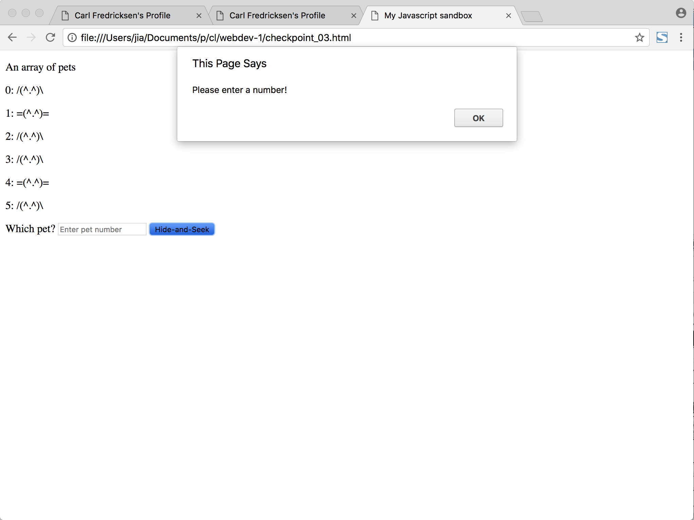

.fx: imageslide

---

# Validating input - 3

Try entering a pet number that doesn't exist. How do you fix it?

    !javascript
    function hideAndSeek(where)
    {
      ...
      var petID = where + "_" + petNumberInput.value;
      var petP = document.getElementById(petID);

      if (petP === null)
      {
        alert("Pet number doesn't exist!");
      }
      ...
    }

---

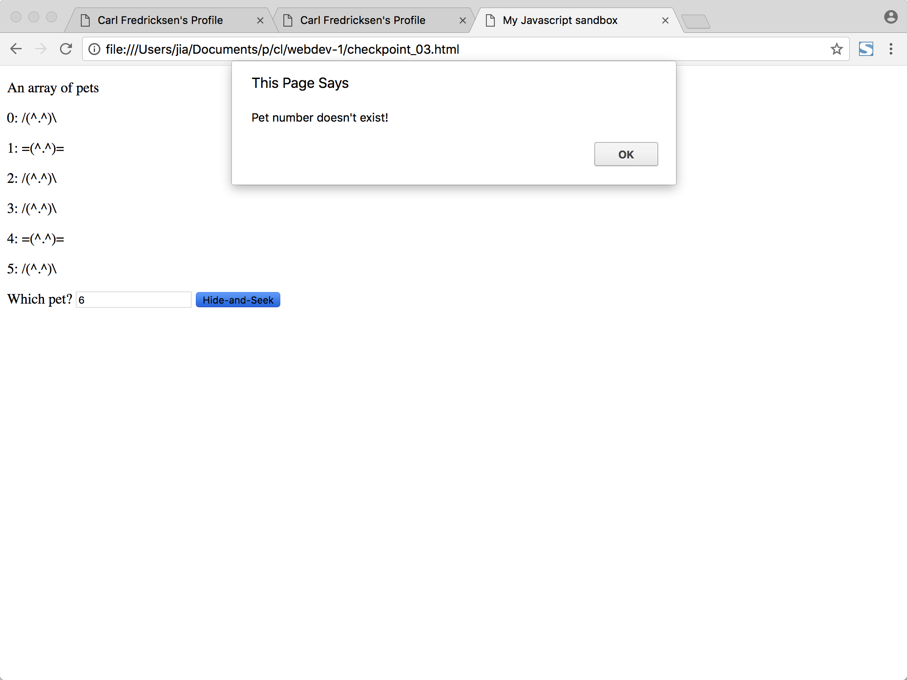

.fx: imageslide

---

# We are almost at the end

### What did we learn in this course?
- HTML
    - `h1`, `p`, `em`, `strong`, `img`, `a`, `ul`, `ol`, `table`, `div`, `input`, `button`
- CSS
    - Embedding in HTML
    - Selector syntax
    - RGB color code
    - Box Model
    - Using `float` and `clear` to create multi-column layout
    - Changing fonts, width
    - Using `visibility` to hide/unhide content

---

# We are almost at the end

### What did we learn in this course?
- Javascript
    - Embedding in HTML
    - Accessing HTML elements by ID
    - Creating HTML elements and attach to page
    - for-loop, if-else, switch
    - Booleans, comparison operators and boolean operators
    - Functions, creating and calling
    - Arrays, creating and accessing elements
    - Events and event handlers
    - Changing CSS class programmatically
    - Validating user input

---

# What next?

### Javascript/HTML5 Game Development

### Web Development, Intermediate Level

---

# The END

---
